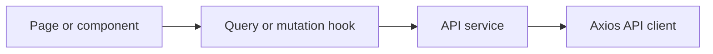

# ConnectDev Frontend

[](https://github.com/Talhaayubkhan/connectDev-frontend/actions/workflows/frontend-quality.yml)

ConnectDev is a developer networking application. It helps developers discover people with similar interests, create professional profiles, send connection requests, and manage their network.

This repository contains the React frontend for the ConnectDev web application. The API and database logic are maintained separately in the [ConnectDev backend repository](https://github.com/Talhaayubkhan/connectDev-backned).

## Main Features

- Register, sign in, and sign out securely
- Recover and reset forgotten passwords
- Browse developer profiles in a discovery feed
- Send, accept, decline, and manage connection requests
- View existing connections and individual developer profiles
- Edit personal details, biography, location, occupation, photo, and skills
- Change the account password from the profile page
- Use protected routes that require an authenticated session
- Receive consistent loading, empty, success, and error feedback
- Navigate with a responsive interface across mobile, tablet, and desktop
- Use keyboard friendly dialogs, labelled form fields, and reduced motion support

> Chat is not currently implemented in this frontend. The interface does not show chat actions until a complete chat flow is available.

## Technology Stack

| Area           | Technology                       |
| -------------- | -------------------------------- |
| User interface | React 19                         |
| Routing        | React Router                     |
| Build tool     | Vite 7                           |
| Server state   | TanStack Query                   |
| HTTP client    | Axios                            |
| Forms          | Formik                           |
| Validation     | Yup                              |
| Styling        | Tailwind CSS 4 and DaisyUI       |
| Animation      | Framer Motion                    |
| Notifications  | React Toastify                   |
| Testing        | Vitest and React Testing Library |
| Code quality   | ESLint and GitHub Actions        |

## How the Frontend Works

The application separates pages, data fetching, and API requests so each part has one clear responsibility.



- Pages and components render the interface and handle temporary UI state.
- TanStack Query hooks fetch remote data, cache responses, and update related queries after mutations.
- Service functions define backend endpoints and return normalized response data.
- The shared Axios client applies the API base URL, credentials, and request timeout.
- Route guards check the current user before showing public or protected pages.

Server data remains in TanStack Query. Local React state is used only for temporary interface state such as open menus, pending buttons, and skill input.

## Application Routes

| Route                   | Access    | Purpose                                    |
| ----------------------- | --------- | ------------------------------------------ |
| `/auth/login`           | Public    | Sign in or create an account               |
| `/auth/forgot-password` | Public    | Request a password reset link              |
| `/auth/reset-password`  | Public    | Set a new password with a valid token      |
| `/feed`                 | Protected | Discover developer profiles                |
| `/profile`              | Protected | View and edit the signed in user's profile |
| `/profile/:userId`      | Protected | View another developer's profile           |
| `/connections`          | Protected | View accepted connections                  |
| `/requests`             | Protected | Review received connection requests        |

Unknown routes display a dedicated not found page. Signed in users are redirected away from authentication pages, while signed out users are redirected to the login page.

## Requirements

- Node.js 22 or newer
- npm
- A running ConnectDev backend API

## Installation

1. Clone the frontend repository:

   ```bash
   git clone https://github.com/Talhaayubkhan/connectDev-frontend.git
   cd connectDev-frontend
   ```

2. Install the exact dependencies from the lock file:

   ```bash
   npm ci
   ```

3. Create your local environment file:

   ```bash
   cp .env.example .env
   ```

4. Set the backend API origin in `.env`:

   ```env
   VITE_API_BASE_URL=http://localhost:3000
   ```

5. Start the development server:

   ```bash
   npm run dev
   ```

The frontend is normally available at `http://localhost:5173`.

### Windows PowerShell

If `cp` is unavailable, create the environment file with:

```powershell
Copy-Item .env.example .env
```

## Environment Configuration

| Variable            | Required | Description                          | Example                 |
| ------------------- | -------- | ------------------------------------ | ----------------------- |
| `VITE_API_BASE_URL` | Yes      | Origin of the ConnectDev backend API | `http://localhost:3000` |

Only the API origin should be stored in this variable. Vite exposes variables beginning with `VITE_` to the browser, so secrets, database credentials, and private tokens must never be placed in `.env`.

Because authentication uses an HTTP only cookie, the frontend and backend must both allow credentialed cross origin requests when they run on different origins.

## Available Commands

| Command                 | Description                                     |
| ----------------------- | ----------------------------------------------- |
| `npm run dev`           | Start the Vite development server               |
| `npm run build`         | Create an optimized production build in `dist/` |
| `npm run preview`       | Preview the production build locally            |
| `npm run lint`          | Check the code with ESLint                      |
| `npm test`              | Run all tests once                              |
| `npm run test:watch`    | Run tests while files change                    |
| `npm run test:coverage` | Generate a test coverage report                 |
| `npm run check`         | Run lint, tests, and the production build       |

## Authentication Flow

1. A user signs in or creates an account.
2. The backend validates the submitted details and creates the session.
3. The browser stores the session in an HTTP only cookie managed by the backend.
4. Axios sends credentials with API requests.
5. TanStack Query stores the current profile and other server data.
6. Public and protected route guards redirect the user when required.
7. Signing out clears cached server data and returns the user to the login page.

The frontend does not store authentication tokens in local storage.

## Project Structure

```text
src/
├── components/
│   ├── common/          Shared cards, inputs, dialogs, and page states
│   └── layout/          Navigation and footer components
├── hooks/
│   ├── auth/            Authentication mutations
│   ├── connections/     Connections and request queries
│   ├── feed/            Discovery feed queries and mutations
│   └── profile/         Profile queries and updates
├── layouts/             Public and authenticated page layouts
├── pages/
│   ├── auth/            Login and password recovery screens
│   ├── connections/     Connections and received requests
│   ├── feed/            Developer discovery feed
│   └── profile/         Personal and public profiles
├── routes/              Route definitions and access guards
├── services/            Axios client and API endpoint functions
├── test/                Shared test setup and render helpers
└── utils/               Route constants, query keys, and validation
```

## Testing and Quality Checks

The test suite covers important regression areas, including:

- Public and protected route behavior
- Login and registration form accessibility
- Password reset request data
- Connection request pending states
- Profile navigation without unfinished chat routes
- Dialog focus and Escape key behavior
- API error messages and profile validation

Every pull request and push to `main` runs the `Frontend quality` GitHub Actions workflow. The workflow installs dependencies, runs ESLint, executes the tests, creates a production build, and audits production dependencies for high severity vulnerabilities.

Run the complete local quality check with:

```bash
npm run check
```

## Responsive Design and Accessibility

The interface uses responsive layouts for authentication, navigation, cards, forms, profiles, and page states. Mobile menus and dialogs provide accessible names, keyboard controls, focus management, and focus restoration. Form controls use connected labels and useful autocomplete values. Animation duration is reduced when the operating system requests reduced motion.

## Security Notes

- Never commit `.env` files or browser exposed secrets.
- Keep authorization rules in the backend even when the frontend hides protected actions.
- Validate all submitted data again on the backend.
- Use secure cookie settings and exact allowed origins in production.
- Review dependency audit results before deployment.

## Contributing

1. Create a focused branch from `main`.
2. Make the required changes without mixing unrelated work.
3. Add or update tests when behavior changes.
4. Run `npm run check` before opening a pull request.
5. Explain the problem, solution, and verification steps in the pull request.

## Related Repository

- [ConnectDev backend](https://github.com/Talhaayubkhan/connectDev-backned)

## Author

Developed by [Talha Ayub](https://github.com/Talhaayubkhan).

## License

This project is licensed under the ISC License.
